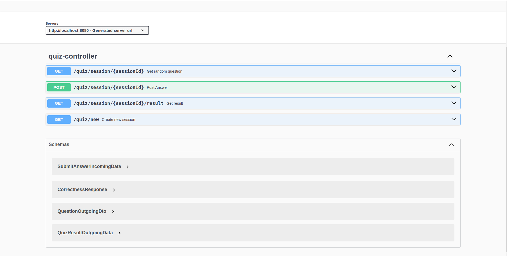
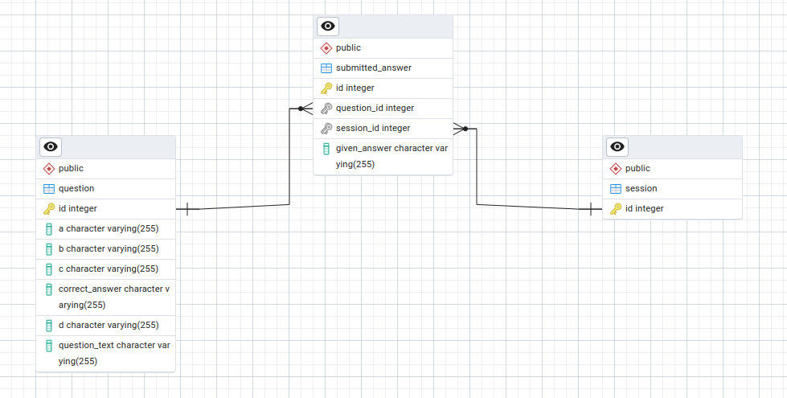

# Conceptile Project

## Overview
Conceptile is a Java-based application with an H2 in-memory database for managing questions and answers. The project uses Spring Boot and provides a REST API. Swagger UI is integrated for API documentation and testing.

---

## Prerequisites

Ensure the following are installed on your system:

- [Java 17+](https://www.oracle.com/java/technologies/javase-jdk17-downloads.html)
- [Maven](https://maven.apache.org/)
- [IntelliJ IDEA](https://www.jetbrains.com/idea/)

---

## Running the Project Locally

1. Clone the project repository:

```bash
git clone  https://github.com/363shubhamrathod/conceptileInternship
```

2. Open the project folder `conceptile Backend` in IntelliJ IDEA.

3. Navigate to:

```
src/main/java/com/example/conceptile/ConceptileApplication.java
```

4. Run the `ConceptileApplication.java` file:
   - Locate the file in the Project Explorer.
   - Click the "Run" button (top-right corner) to start the application.

5. The application will start, and you can access the Swagger UI at:

```
http://localhost:8080/swagger-ui.html
```

---

## Configuration

All application properties are configured in the `application.yml` file. This file is located in the `src/main/resources` directory.

The `application.yml` contains database configurations, server settings, and other application-specific properties. Modify it as needed for your environment.

---

## API Documentation

Swagger UI is integrated into the application for API documentation and testing. After starting the application:



1. Open your web browser and navigate to:

```
http://localhost:8080/swagger-ui.html
```

2. Use the interactive interface to test the available APIs.

---

## Database


The project uses an H2 in-memory database. To access the H2 console:



1. Navigate to:

```
http://localhost:8080/h2-console
```

2. Use the following credentials:
   - **JDBC URL**: `jdbc:h2:mem:testdb`
   - **Username**: `sa`
   - **Password**: `password`
`
3. You can execute SQL queries and inspect the database schema.

---

## License

This project is licensed under the MIT License. See the LICENSE file for details.
